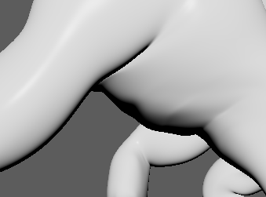
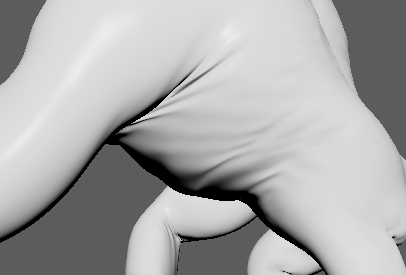
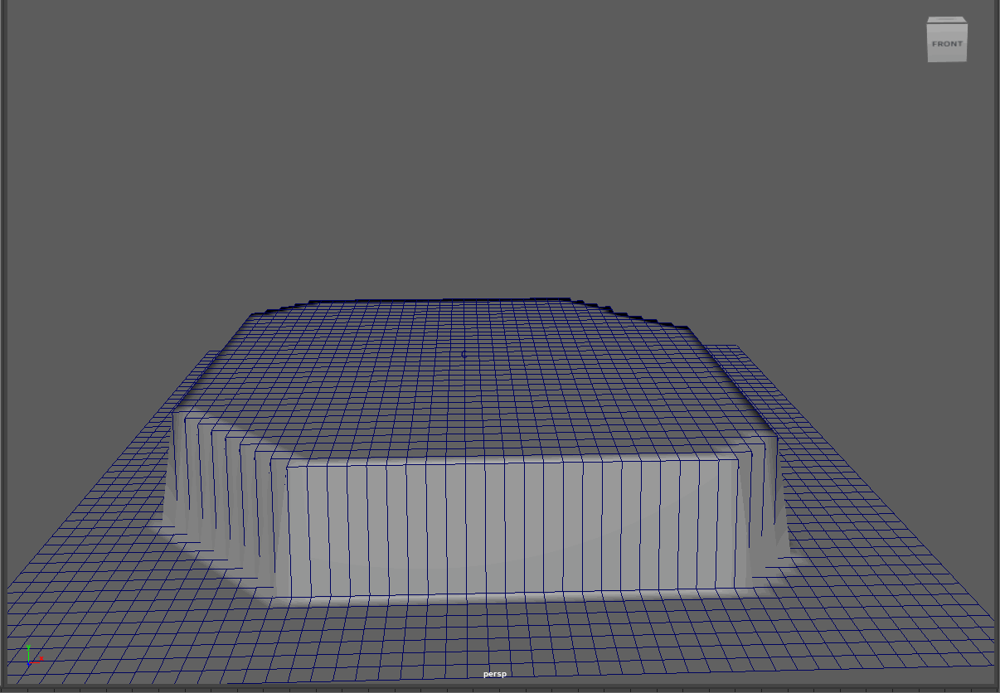
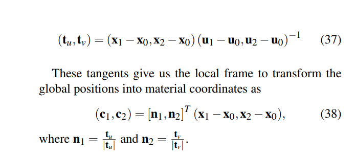
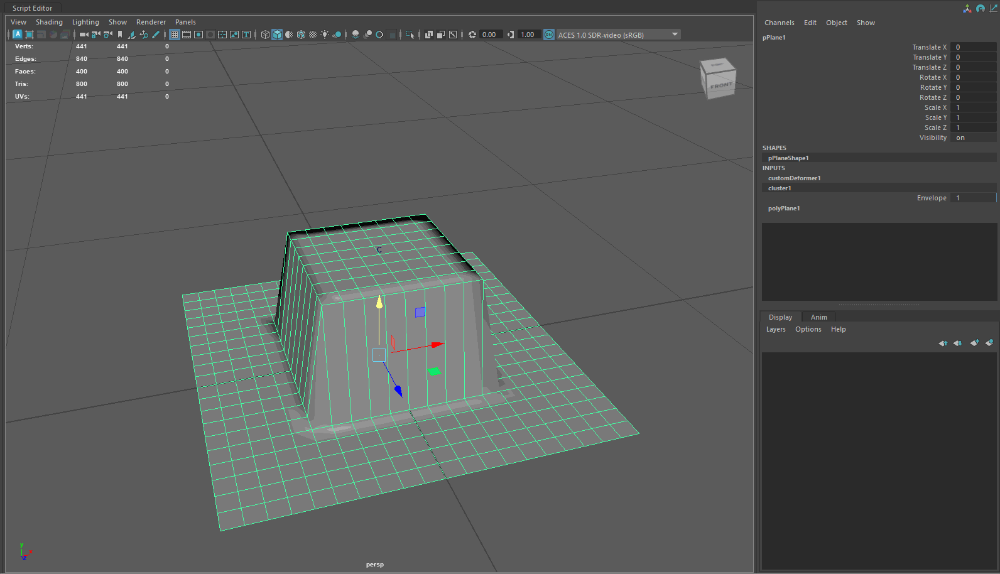

Maya Wrinkle Deformer
================

* Caroline Fernandes
  * [LinkedIn](https://www.linkedin.com/in/caroline-fernandes-0-/), [personal website](https://0cfernandes00.wixsite.com/visualfx)
* Tested on: Maya 2025, Windows 11, i9-14900HX @ 2.20GHz, Nvidia GeForce RTX 4070

This is a personal project which began in Spring 2026. The intended outcome is to create a wrinkle deformer plugin in Autodesk Maya.
[Presentation](https://docs.google.com/presentation/d/1HES0ORkbsIj7sBdEHK1YnMoZ5uYrH4jYiyMaB22oyYM/edit?usp=sharing)

Much of the implementation is built on the following SIGGRAPH paper [Strain Based Dynamics Paper](https://dl.acm.org/doi/10.5555/2849517.2849542)

## Geodesic Phase Integration and Arc-length conservation

  

Breadth-First Search is used to propogate over the edges of the mesh and find where to apply the displacement. 

## Strain Tensor (Green-St Venant strain)

 

 

The Strain Tensor is calculated to give mesh independent strain calculation using the UV space. These material coordinates are used in calculating the deformation gradient which is then used to calculate strain. The eigenvalue decomposition provides the strain values and the eigenvalue provides the direction. In this example, I am displacing the mesh along the normal using the tensor.

## Laplacian smoothing

 

Tension weighted smoothing moving points towards the average position of its neighbors.
